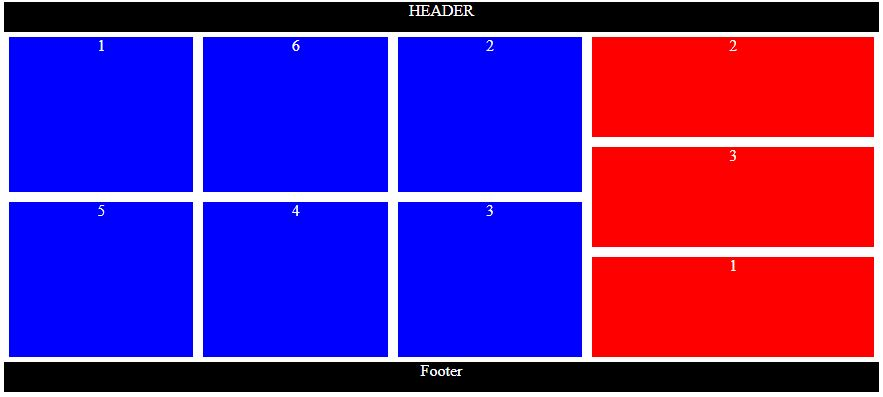

# Practice Instructions

- Utilizing the image file of the same name (flexPractice.jpg) build a site using flex to achieve the design in the image:
  
- There should be a minimum height for each div but there should be no maximum height. (min-height property)
- Once you are finished with the styling, add actual content of varying sizes to the divs to ensure they still flex appropriately. This can be done with filler text or with actual content of your choice.