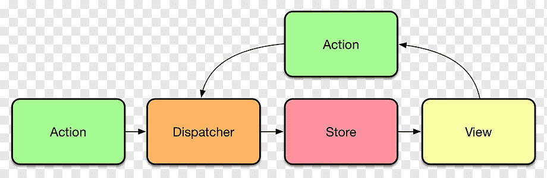

# What is Flux?

Flux is a pattern that was introduced to help manage state in larger scale applications. It generally follows a very simple pattern. This pattern, as outlined below, helps you only update the pieces of state you need to while also giving you access to the entirety of the state of an application wherever you might need it.

As you can see above, the flux pattern is divided into a few key pieces. Those pieces are actually very straightforward and easy to understand as outlined below:

## Action

This is the action you want to actually happen; it is both the data you want to set/update and what that change represents. One thing to note is that not all actions require data (usually referred to as the 'payload') but they do require some sort of 'name' which is called a type. If you think of a database of information. You could have the following actions as examples:

1. Update entry - Requires both the action type ("Update Entry") AND the data (reference to entry being updated AND new data)
2. Read all entries - In this case your action type might be something like "Get Entries" but you don't actually need to provide it with any more information. The action type itself tells you everything the database would need to know. The next read example would require information to work though.
3. Read entry with a specific id - This action would require both a type ("Read by id") AND data (the id of the data you want to get)

## Dispatcher

The dispatcher is a method that manages all of the data flow in the application. It doesn't actually store the data (that is the aptly named store), but it does handle the logic and any actions and lets the stores know what needs to happen. Simply put, you have some sort of action that is then sent to the dispatcher. That dispatcher says: "I need to do X with Y data". It handles that information and sends it to any needed stores so the stores can update accordingly.

## Store

Stores are what 'stores' the actual state itself. It is the logic that you subscribe to and the information that you need to access anywhere in your application. In the Redux pattern, this is split out into the store and what is called a reducer. The stores gets the action from the dispatcher and then look at the type. If the type matches one it knows about (basically one that you set up code for) it handles the appropriate logic and then sends out any changes in data to anything paying attention to it.

## View

The easiest way to think of it is it is the component(s) that are currently being used. Usually this will be the components that are on the user interface, however not ALL of the component might actually be shown to the user, but since the component is in use, the entirety of it counts as the view.

## Summary:

`Action` =  Object that contains all necessary information to do something. Requires a 'type' property, but does not actually require data.

`Dispatcher` = Manages the data flow; broadcasts actions to all stores.

`Store` = Contains the state. Gets the action from the dispatcher and looks at the type to handle logic accordingly.

`View` = The components that are currently being used by the application (usually the user interface).

Now that we know the basics of flux, let's take a look at it in practice with Redux
