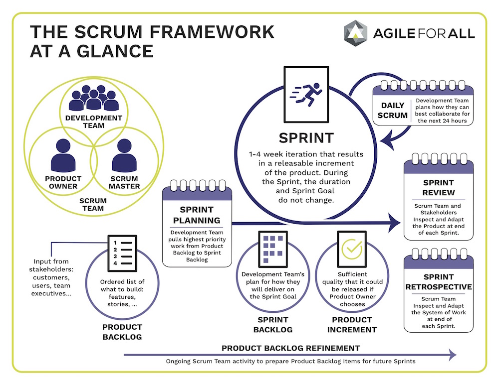

# SCRUM Basics

Scrum is a framework based on Agile. It promotes self-organizing, self-motivating teams that deliver small, fully functional pieces of a deliverable in iterations called _sprints_. Sprints can be one to four weeks long, with two or three weeks being the industry standard.

## SCRUM Team Roles

Scrum works best when a team is focused on delivering a single product or suite of related products. The Scrum Team is composed of:

- Three to nine developers with the collective skills to design, build, and test any deliverables related to the product.

- A _Product Owner_ who acts as the voice of the customer and is responsible for building and managing the work, called the _backlog_.

- A _Scrum Master_ who facilitates meetings, protects the team from external distractions, removes impediments, and is looked to as the expert in Agile and Scrum practices.

## Backlogs and User Stories

- **Product Backlog**
  The full backlog of work related to a product.

- **Sprint Backlog**
  The backlog of work committed to in a sprint.

- **User Story**
  An increment of work that can be assigned to one member of the development team that can be completed within the constraints of the sprint. User stories originated with the Xtreme Programming (XP) framework, but are often used to organize work items when practicing Scrum. User Stories are written based on the concept of the 3Cs (Card, Conversation, Confirmation) and identify the Who, What, and Why of the work item. _(Source: Essential XP(https://ronjeffries.com/xprog/articles/expcardconversationconfirmation/))_
  

## SCRUM Events

Each sprint incorporates regular, timeboxed meetings called _ceremonies_ or _events_. These include:

- **Daily Scrum**

  Required Attendees: Development Team

  Optional Attendees: Scrum Master, Product Owner

  Timebox: 15 minutes

  A stand-up meeting where each member of the team provides a quick status update, often in the following format: “I did x yesterday, I’m doing y today, and I have n impediments to my work”.

- **Sprint Planning**

  Required Attendees: Scrum Team

  Timebox: 1 hr/week of sprint

  A meeting where work for the sprint, called user stories, is identified and organized by priority. The team then identifies which of the development team members will own and work on those stories that are assigned to the sprint.

- **Backlog Grooming/Refinement**

  Required Attendees: Scrum Team

  Optional Attendees: Stakeholders

  Timebox: Varies

  A meeting where the Product Owner explains the who, what, and why of the user stories, and the team identifies the how. The team also identifies and assigns the effort behind the work by assigning a value to the user story called story points.

- **Sprint Review**

  Required Attendees: Scrum Team, Stakeholders

  Timebox: 30-60 minutes

  A demonstration of the completed sprint work that is provided to the customer/stakeholder for feedback and approval.

- **Sprint Retrospective**

  Required Attendees: Scrum Master, Development Team

  Optional Attendees: Product Owner

  Timebox: 30 minutes

  A post-mortem discussion of the Sprint, focusing on what went well and what could be done better, and opportunities for team improvement and experimentation are identified.

## MMP and MVP

- MVP (Minimum Viable Product):
The least amount of features your product can have to be usable.

- MMP (Minimum Marketable Product):
The least amount of features your product can have to be marketable to the public.